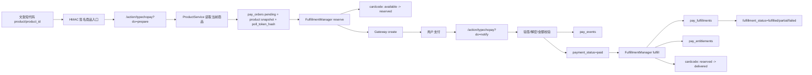

# TypechoPay Architecture

## 目标

Typecho 只承担订单中心职责：

- 渲染可信支付入口
- 创建订单
- 调用网关创建支付会话
- 接收并验签异步通知
- Webhook 失败时主动查单补状态
- 幂等更新订单状态
- 保留事件审计
- 通过交付处理器发放付费阅读权益和卡密

支付渠道被隔离在 `src/Gateways` 下，业务层不直接依赖某个支付 SDK。
支付网关只判断“钱是否支付成功”，商品和交付层决定“付款后给用户什么”。

## 请求路径

## 关键表

`pay_orders` 是订单事实表。`out_trade_no` 是商户侧唯一订单号，支付平台交易号只写入 `platform_trade_no`。`poll_token_hash` 保存订单查询凭证哈希，前端轮询必须携带原始 token 或匹配当前登录/访客所有者。`return_to` 保存支付完成后的同站跳转地址，`last_queried_at` 和 `query_count` 用于服务端主动查单节流。订单同时保留 `payment_status` 和 `fulfillment_status`，并保存 `product_id`、`product_version`、`product_snapshot_json` 用于审计创建订单时的商品状态。

`pay_events` 是通知/主动查单事件表。即使通知失败，也保留事件类型、签名结果、provider event id/type、平台交易号、远端 IP、请求头和 payload 摘要，方便排查支付平台重试。

`pay_products` 保存当前商品价格、币种、购买策略和库存策略。`pay_product_deliverables` 保存商品的交付规则，例如 `post_access`、`content_block`、`cardcode`，后续可扩展 `membership`、`download`。

`pay_fulfillments` 是订单交付记录表，以 `(order_id, deliverable_id)` 去重。重复支付回调会复用已有交付结果，不会重复发放同一个交付项。

`pay_entitlements` 是最小权益表。订单确认支付后先进入 `paid_pending_grant`，由 `FulfillmentManager` 调用对应 handler 写入权益或卡密交付；写入成功后订单 `status=paid` 且 `fulfillment_status=fulfilled`，失败时保留 `payment_status=paid` 并进入 `grant_failed` / `fulfillment_status=failed`，后台可重发交付。

`pay_nonces` 是旧版 `do=create` 兼容入口的一次性 nonce 表。新版短代码默认走 `do=prepare`，点击时动态创建订单并生成轮询凭证，避免缓存页面复用短期 nonce。

`pay_card_batches` 记录后台导入批次。`pay_card_items` 保存卡密库存，正文使用 AES-256-GCM 密文保存，基于站点密钥的 HMAC 指纹用于同一商品内去重，状态包括 `available`、`reserved`、`delivered`、`void`、`compromised`。创建订单时通过条件更新把一张 `available` 卡改为 `reserved`，支付成功后改为 `delivered`，支付失败/取消/过期/关闭时释放未交付的预留。

## 网关契约

每个网关实现：

- `create(array $order): PayCreateResult`
- `notify(array $headers, string $rawBody, array $query, array $post): NotifyResult`
- `query(array $order): NotifyResult`

网关只负责和支付平台通信、验签、把平台状态转换成统一结果。订单写入和状态流转只在 `OrderService` 中完成。

主动查单由 `/action/typechopay?do=query` 触发，但请求必须携带订单轮询 token 或匹配当前订单所有者。`OrderService` 会根据 `last_queried_at` 做服务端节流，避免前端轮询直接等价为支付平台轮询。

## 交付契约

交付处理器实现：

- `validate(array $product, array $deliverable, array $buyer): void`
- `reserve(array $order, array $deliverable): void`
- `fulfill(array $order, array $deliverable): array`
- `release(array $order, array $deliverable): void`
- `revoke(array $order, array $deliverable): void`

当前 `FulfillmentManager` 已接入：

- `post_access`：写入 `pay_entitlements`
- `content_block`：写入 `pay_entitlements`
- `cardcode`：预留库存、支付成功交付、失败释放

## 当前边界

当前卡密闭环已经覆盖后台导入、下单预留、支付后交付、重复回调幂等、失败释放和用户凭证查看。尚未实现低库存邮件、退款撤销后的 `compromised` 自动标记、管理员手动作废/补发、下载资源、VIP、余额、积分和优惠码处理器。
