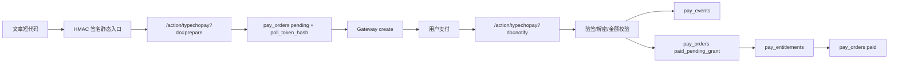

# TypechoPay Architecture

## 目标

Typecho 只承担订单中心职责：

- 渲染可信支付入口
- 创建订单
- 调用网关创建支付会话
- 接收并验签异步通知
- Webhook 失败时主动查单补状态
- 幂等更新订单状态
- 保留事件审计
- 发放最小付费阅读权益

支付渠道被隔离在 `src/Gateways` 下，业务层不直接依赖某个支付 SDK。

## 请求路径

## 关键表

`pay_orders` 是订单事实表。`out_trade_no` 是商户侧唯一订单号，支付平台交易号只写入 `platform_trade_no`。`poll_token_hash` 保存订单查询凭证哈希，前端轮询必须携带原始 token 或匹配当前登录/访客所有者。`return_to` 保存支付完成后的同站跳转地址，`last_queried_at` 和 `query_count` 用于服务端主动查单节流。

`pay_events` 是通知/主动查单事件表。即使通知失败，也保留事件类型、签名结果、provider event id/type、平台交易号、远端 IP、请求头和 payload 摘要，方便排查支付平台重试。

`pay_entitlements` 是最小权益表。订单确认支付后先进入 `paid_pending_grant`，由 `AccessService::grant()` 写入权益；写入成功才变为 `paid`，失败进入 `grant_failed` 并保留后台重发入口。

`pay_nonces` 是旧版 `do=create` 兼容入口的一次性 nonce 表。新版短代码默认走 `do=prepare`，点击时动态创建订单并生成轮询凭证，避免缓存页面复用短期 nonce。

## 网关契约

每个网关实现：

- `create(array $order): PayCreateResult`
- `notify(array $headers, string $rawBody, array $query, array $post): NotifyResult`
- `query(array $order): NotifyResult`

网关只负责和支付平台通信、验签、把平台状态转换成统一结果。订单写入和状态流转只在 `OrderService` 中完成。

主动查单由 `/action/typechopay?do=query` 触发，但请求必须携带订单轮询 token 或匹配当前订单所有者。`OrderService` 会根据 `last_queried_at` 做服务端节流，避免前端轮询直接等价为支付平台轮询。

## 当前边界

此版本仍不是卡密/库存交付系统。已支付后只发放 `post` 或显式 `biz_type` / `biz_id` 绑定的付费阅读权益；下载资源、VIP、余额、积分、优惠码和退款状态仍需要独立业务处理器扩展。
